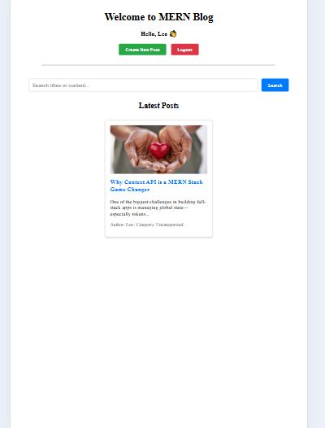
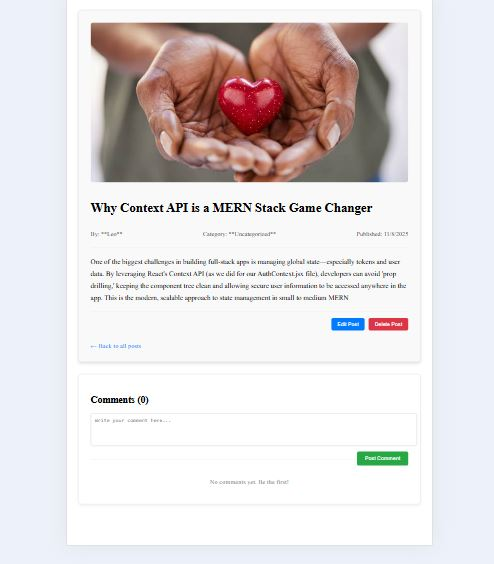

# MERN Stack Blog Application

This project implements a full-stack blog platform using the MERN (MongoDB, Express.js, React.js, Node.js) stack, demonstrating seamless integration, secure authentication, and advanced features including file uploads and dynamic querying.

## Project Overview

This application fulfills all requirements for **Week 4: Deep Dive into MERN Stack Integration**, showcasing complete CRUD operations for Posts and Categories, robust user authentication, and advanced features designed for a production environment.

## ⚙️ Setup Instructions

### Prerequisites
* Node.js (v18+)
* MongoDB (Atlas or Local Instance)
* Access to the project's repository (via GitHub Classroom assignment).

### Backend Setup (server)

1.  Navigate to the `server` directory: `cd server`
2.  Install dependencies: `npm install`
3.  **Configure Environment:** Create a file named `.env` in the `server` directory. Copy the contents of `.env.example` into your new `.env` file and replace the placeholder values (e.g., `<username>`, `<password>`) with your actual credentials.
4.  Start the server: `npm run dev`

### Frontend Setup (client)

1.  Navigate to the `client` directory: `cd client`
2.  Install dependencies: `npm install`
3.  Start the client: `npm run dev`

The React app will run on `http://localhost:5173`, and API calls will be automatically proxied to the backend on port 5000 via the `vite.config.js` proxy.

## 💡 API Documentation (Key Endpoints)

All endpoints are prefixed with `/api`. Authorization requires a valid JWT in the `Authorization: Bearer <token>` header for private routes.

| Method | Endpoint | Description | Access |
| :--- | :--- | :--- | :--- |
| **POST** | `/api/auth/register` | Creates a new user. | Public |
| **POST** | `/api/auth/login` | Authenticates a user and returns a JWT. | Public |
| **GET** | `/api/posts` | Fetches posts with **Search, Filter, & Pagination**. Accepts `?search`, `?category`, `?page`, `?limit`. | Public |
| **POST** | `/api/posts` | Creates a new post (requires body validation). | **Private** (Author) |
| **PUT** | `/api/posts/:id` | Updates an existing post. | **Private** (Author) |
| **DELETE** | `/api/posts/:id` | Deletes a post. | **Private** (Author) |
| **POST** | `/api/posts/:id/comments` | Adds a new comment to a post. | **Private** (User) |
| **GET** | `/api/posts/:id/comments` | Fetches all comments for a post. | Public |
| **POST** | `/api/upload` | Uploads a featured image file via `multer`. | Private |

## ✨ Features Implemented (Task Completion)

This project successfully implemented all required and advanced features:

1.  **User Authentication & Authorization:** Complete registration/login flow using JWT. Post creation, updating, and deletion are restricted to the original authenticated author (`isAuthor` check).
2.  **Core CRUD Operations:** Full management for Posts (`/api/posts`) and Categories (`/api/categories`).
3.  **Image Uploads:** Implemented using **`multer`** middleware to handle `multipart/form-data` and save files to the static `/uploads` folder.
4.  **Searching & Filtering:** The `GET /api/posts` controller uses MongoDB `$regex` for powerful, case-insensitive searching and filtering by category ID.
5.  **Pagination:** The backend returns limited post data, and the frontend renders interactive **Previous/Next** controls.
6.  **Comments:** Fully functional nested resource (`/api/posts/:id/comments`) with a dedicated `Comment` model and integrated submission form on the post detail page.

## 🧑‍💻 Author

This MERN Stack Blog Application was developed and integrated by:

* **Name:** [Your Name Here]
* **GitHub:** [Austinixe]


## 🖼️ Screenshots

### 1. Homepage & Search
* **Purpose:** Verifies Pagination and Search/Filtering controls are functional.
* 

### 2. Post Detail & Authorization
* **Purpose:** Verifies that the Edit and Delete buttons are visible only to the authenticated author.
* 


# MERN Stack Integration Assignment

This assignment focuses on building a full-stack MERN (MongoDB, Express.js, React.js, Node.js) application that demonstrates seamless integration between front-end and back-end components.

## Assignment Overview

You will build a blog application with the following features:
1. RESTful API with Express.js and MongoDB
2. React front-end with component architecture
3. Full CRUD functionality for blog posts
4. User authentication and authorization
5. Advanced features like image uploads and comments

## Project Structure

```
mern-blog/
├── client/                 # React front-end
│   ├── public/             # Static files
│   ├── src/                # React source code
│   │   ├── components/     # Reusable components
│   │   ├── pages/          # Page components
│   │   ├── hooks/          # Custom React hooks
│   │   ├── services/       # API services
│   │   ├── context/        # React context providers
│   │   └── App.jsx         # Main application component
│   └── package.json        # Client dependencies
├── server/                 # Express.js back-end
│   ├── config/             # Configuration files
│   ├── controllers/        # Route controllers
│   ├── models/             # Mongoose models
│   ├── routes/             # API routes
│   ├── middleware/         # Custom middleware
│   ├── utils/              # Utility functions
│   ├── server.js           # Main server file
│   └── package.json        # Server dependencies
└── README.md               # Project documentation
```

## Getting Started

1. Accept the GitHub Classroom assignment invitation
2. Clone your personal repository that was created by GitHub Classroom
3. Follow the setup instructions in the `Week4-Assignment.md` file
4. Complete the tasks outlined in the assignment

## Files Included

- `Week4-Assignment.md`: Detailed assignment instructions
- Starter code for both client and server:
  - Basic project structure
  - Configuration files
  - Sample models and components

## Requirements

- Node.js (v18 or higher)
- MongoDB (local installation or Atlas account)
- npm or yarn
- Git

## Submission

Your work will be automatically submitted when you push to your GitHub Classroom repository. Make sure to:

1. Complete both the client and server portions of the application
2. Implement all required API endpoints
3. Create the necessary React components and hooks
4. Document your API and setup process in the README.md
5. Include screenshots of your working application

## Resources

- [MongoDB Documentation](https://docs.mongodb.com/)
- [Express.js Documentation](https://expressjs.com/)
- [React Documentation](https://react.dev/)
- [Node.js Documentation](https://nodejs.org/en/docs/)
- [Mongoose Documentation](https://mongoosejs.com/docs/) 